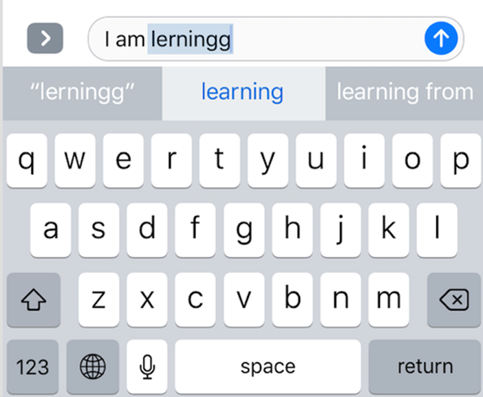
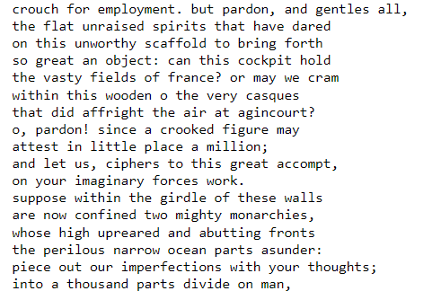
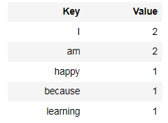
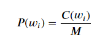
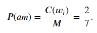

# Language Models: Auto-Correct

Auto-correct is an artificial intelligence technology that automatically corrects spelling and grammatical errors as the user types. A common and prominent example of this technology is the spell-check feature on smartphone keyboards or in word processors like Microsoft Word. This technology helps users to write correctly and improve both the accuracy and speed of typing..

While there are many modern tools available, here we will discuss a foundational technology that underpins these new advancements. This classic technology is mentioned in the Coursera course: [Natural Language Processing](https://www.coursera.org/learn/probabilistic-models-in-nlp?specialization=natural-language-processing).

## Streamlit web
    streamlit run app.py

I built a system almost similar to google's, it's used to illustrate the technique I'm using, I just used python's streamlit library.

## Technology

The algorithm I mention here is the most basic of AUTO-CORRECT (2007). Maybe at the present time there are many other, newer algorithms that have been born.

I've got a small data set with a lot of sentences:

You can use any data you have, but make sure it is large enough and contains as many words as possible so that the system works best and is most general with natural language.

Next, I split all my data into a set of tokens, with each token being a unique word, accompanied by the number of times that word appears in the original raw data set.

For example, I have a sentence: "I am happy because I am learning"
With Desired results:

* Probability:

Numerator: Number of occurrences of that word in the original data set containing many sentences above.
Denominator: Number of words in that original data set.
For example: 'I am happy because I am learning'
The probability of “am” is 2/7

We will use this method throughout the problem.
• Cases that users often encounter when entering text, need to correct the errors:
+ The user enters the missing text: whatt -> what
+ The user enters jumbled text: hate -> ehat
+ The user entered the wrong word: smim -> swim
+ The user enters a missing word: whch -> which

• We need to create 4 functions corresponding to the 4 cases above:

+ delete_letter: takes a word, it returns all possible strings that have had a character removed.

+ switch_letter: takes a word, it returns all possible strings that have two adjacent letters converted.

+ replace_letter: takes a word, it returns all possible strings that have a letter replaced by another letter.

+ insert_letter: takes a word, it returns all possible strings that have an additional character inserted.

## Additional
    Language_Models_Auto_Correct_Documentation.docx

I have prepared a Vietnamese version for Vietnamese friends [🇻🇳] to easily refer to.

## Contact
    Content writer: Ha Khai Hoan
    Email: khaihoan.ai@gmail.com

GitHub: [Hoanha2101](https://github.com/Hoanha2101)